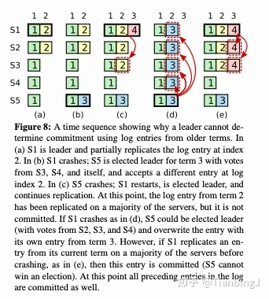

## leader election

### 至多只有一个leader
在集群中至多只有一个leader，leader负责处理客户端的请求，并把请求转发给其他节点。

### 防止脑裂
如何防止脑裂，raft使用多数选举的方式来保证，只有获得了大多数投票一个server才能变成leader。

这也是为什么要持久化 term 和 vote for，也是为了防止一个server投出多票从而保证至多只有一个leader。
vote for：假设有server1和server2同时进行选举，而server3给server1投票后没有持久化vote for就重启了，等他收到了server2的拉票请求并不知道自己已经投票了，他又投给server2，那么就出现了两个leader.
term：同样要持久化term，不然server1、server2竞选，你投了server1后挂掉了，然后你重启你的term不对（不管你是从0开始还是说从log最后一条推断），你可能term更小，然后server2向你拉票，然后你就会给term更大的server2也投票了，此时出现两个leader。

### 什么时候同意什么时候反对
其实投票就是大多数机制，只有一个candidate首先term得大于等于自己的term我们才有可能给他投票，否则的话这个candidate应该马上停止选举，并且更新自己的term。

我们首先要保证就是已经被大多数复制的日志是绝对不能丢的，也就是说后续当选leader的必须要有那些，
所以投票的条件就变成了：
1. candidate最后一条log的term > 自己最后一条日志的term
2. or candidate最后一条log的term == 自己最后一条日志的term && candidate最后一条日志的id > 大于自己最后一条日志的term。
所以这就保证了能竞选成功的candidate必须有被大多数已经复制的日志，并且它可以有一些当时被旧leader start但是只有小部分复制的log，它继续完成那个旧leader的任务。

### 什么时候开始选举
leader会定时向follower发送心跳，并且也会有日志添加，一个server收到了大于等于自己term的这些，就会重置选举超时时间。
注意一个server选举超时时间当然要比leader发送心跳的间隔时间大，不然心跳发送也是需要时间的，所以通常选举超时时间是发送心跳时间间隔的两倍。
首先已经有了日志添加时也会重置server选举超时时间，所以已经稍微避免多个server同时开始选举抢票的情况，但是为了进一步优化这个问题，实际上选举超时间在两倍的心跳发送间隔上再加一个随机的时间。

总结：如果leader挂了或者某个follower收不到心跳(最小的等待时间(至少要有rpc往返时间 + 心跳发送间隔) + 一个短暂的随机时间(避免同时选举抢票的情况))

## 日志添加
如果日志id 和 term一样，说明该日志的cmd也是一样的，并且个该id之前的也都是完全一样的。如何做到这一点呢？是通过保证不停地复制leader的日志，并丢弃后面不同的来保证的。

### match id(单调递增!) 与 next id
事实上next id总是会出现错误的情况，它是一种乐观不停的试错然后修改的过程。
1. next id > match id
一开始初始化的时候乐观的认为所有的server都复制了所有的日志，next id > match id + 1，实际上通过reply来不停的修改直到pre log id存在。看似next id总是会大于match id，直到match id + 1。
2. next id <= match id
但是next id无论怎样也无法保证不会出现 next id <= match id的时候，首先最无法避免的就是增加日志成功时，reply丢失，那么next id 就会小于等于 真正的match id。

然后就是另外一些情况，例如心跳先发送，但是reply晚到，比如心跳发送了LLI=8,然后增加日志[9,9],增加日志的reply回来了，next id=10，match id=9，然后心跳的reply回来了，next id=9，match id=8。

又或者直接举一个例子:我们发送了增加日志[8,8]的rpc，rpc在网络中堵塞了，然后leader认为失败了，重新下一轮日志增加，然后恰好此时客户端start日志9，leader就会发送增加日志[8,9]rpc，server收到后增加了[8，9]。
但是此时之前堵塞的rpc又到了，**server**如果不去判断match id，就会新增加[8,8]，导致暂时的将增加的9又丢了！注意是暂时！虽然leader不会再对第一条rpc的reply做出处理，已经认为它失败了，
但是server那里不判断就会暂时的把9丢弃掉。注意下次添加成功的时候其实还会把9加上，但是如果当时server都已经apply了9，但是你又把9暂时的给扔了，这期间就会导致错误的！
并且不只是说在server apply后出问题，即使server没有apply，leader apply后也会出问题：比如有三个节点时，server1把添加的9又给丢了，另外一个server2还没来的即添加9，leader实际上已经apply了9，
还没来得及告诉server1已经apply了，那么server1或者server2无论谁成为了leader，都找不回来了9了，出现问题了！！！！！！！

如何解决上述问题，那么就是在rpc中找到第一个不存在的log，从那里开始添加，如果找不到，甚至rpc中的全都有，并且还比rpc中多，那么多半就是那个rpc是迟到的rpc，它已经被后发的rpc给代替. 那么是否会出现没法丢弃错误日志的情况呢？其实没啥事，因为它迟早要被正确的给顶替了，并且它也不会被错误的提交！**其实论文中都已经说的很清楚了，如果发现了第一个冲突的日志，即id相同term不同时， 就删除掉该id后面所有的，然后添加不在日志中的新条目！也就是说如果没有冲突的，那么日志中比entries中多不用管的！！rpc很有可能是旧的**

所以我们处理时一定要保证match id是递增，并且不能出现丢弃已经commit的日志，哪怕是暂时的丢弃。不只是leader，server也是要严格递增！

我们希望充分利用心跳，所以有时候心跳变成了日志添加，比如在日志添加reply回来之前又发心跳，那么心跳此时就是跟上一个日志添加相同，从而导致发送了两份相同的日志添加


**我们最后又改变了策略，心跳还是不要负责别的，只是单纯的心跳，然后多负责一个Leader Commit Id。不在负责日志添加、next id、match id的修改。**

### Leader Commit id
已经提交的日志被覆盖的问题！
首先先说总结：leader只能commit自己任期的日志，从而间接的提交之前任期的日志。
原论文中很详细的描述了这个问题，并且给出了解决方案，也就是上面那句总结。

注意黑框表示谁是leader，出现了已经提交的日志被覆盖的情况。


但是这又会引入另外一个问题：假如有三个节点1，2，3，都只有日志1，当leader1接收到日志2时，发送了server2，server2添加该日志并返回reply，leader1收到后reply后apply日志2，与此同时leader1挂掉，server3没有收到日志。server2就会竞选成为新leader，此时也没有客户端发送新日志了，server2也无法apply非自己任期的日志，一直这样下去客户端一直无法查询已经apply的日志2。one测试的时候也会通不过，这样出现的机率很低，往往发生在最后一条one的时候，一个接收到日志但是后面因为心跳原因超时选举为新的leader。
似乎在leader当选后马上发送一条空日志可以解决这个问题，之前出现这种情况的时候选举超时时间是心跳间隔的两倍，但是我把心跳时间缩短，把选举超时时间设置为心跳时间的4倍 + 随机时间，选举时间就是心跳间隔4-7倍，然后测试几百次不会再出现上述情况。但是这只是减小了发生该情况的机率，真正解决办法还得是leader当选后马上发送一条空日志！

### append entries reply 优化

``` go
type AppendEntriesReply struct {
	Term_    int // 答复者的term,用来让leader做更新
	Success_ bool

	// optimization, not necessary
	XLen_ int // log id of follower's last log. if it is to short, leader next id is that

	// 如果leader包含XTerm_的日志，那么就从该term的最后一条作为next开始尝试同步。如果leader不包含该XTerm_的日志，那么就从XIndex_开始尝试同步，即直接跳过follower中该term所有的日志。
	XTerm_ int // term in the conflicting prev entry (if any)
	XId_   int // id of first entry with that term (if any)

	// 如果leader不包含该term的日志，说明follower中该term的日志应该都是错的，是因为网络分区旧leader或者跟旧leader在同一个分区导致的无效的log.那么该term的日志都是无效的，next就可以直接跳过该term。
	// 如果leader包含该term的日志说明该follower中该term的日志可能有一些是正确的，也就是说leader包含的该term的都是正确的，所以从leader该term的最后一条开始发送。

	// 与论文中一条一条日志进行同步相比，这种方法相当于一个一个term进行同步，可以节省大量的RPC数量，从而节省时间。
	// 从直觉上来讲，一个Follower如果与Leader有冲突的日志，那么这个Follower要么是一个旧的Leader，在宕机前接收了日志但是还没来得及与其他Follower同步，要么是一个和旧的Leader在同一个网络分区的Follower。
	// 在网络恢复后或者宕机重启后，新Leader的term必然比之前大，之前的term接收的但未同步的日志是要被覆写的，因此一个一个term进行同步是合理的。
}
```

## 持久化

避免冗余的持久化
小分区leader还是统计一下心跳的reply，没必要啊，不然小分区也会不停的选举，这没什么意义，无非就是客户端能更快的找到真的leader。
现在速度慢是为什么呢？慢在哪里了啊！！！！ 持久化的地方好好优化一下


## 快照

我们暂且不考虑内存中的日志，我们只考虑未丢弃的日至，不管它在内存还是在磁盘。对于打快照的点，在点之前的日子都会被丢弃。此时就存在一个问题，首先打快照的点一定是commit的点，意味着在这之前的日志都被多数复制了，那么可能存在部分日志没有被少数节点复制。少数节点分为以下两种情况：

1. 少数节点是已经掉线的，他们重新上线需要传快照（这些节点缺少大量的日志）。
2. 可能因为网络等原因，暂时少复制了几条日志的节点，比如恰好就少了打快照点的那条日志，重新给这种节点传快照很浪费。

如果我们选择leader不丢弃还有follower需要的日志，这样如果一个Follower关机了一周，那么leader这一周都没法通过快照来减少自己内存消耗，那存在很严重的问题。
Raft选择的方法是，Leader可以丢弃Follower需要的Log。所以，我们需要某种机制让AppendEntries能处理某些Follower Log的结尾到Leader Log开始之间丢失的这一段Log。解决方法是（一个新的消息类型）InstallSnapshot RPC。
